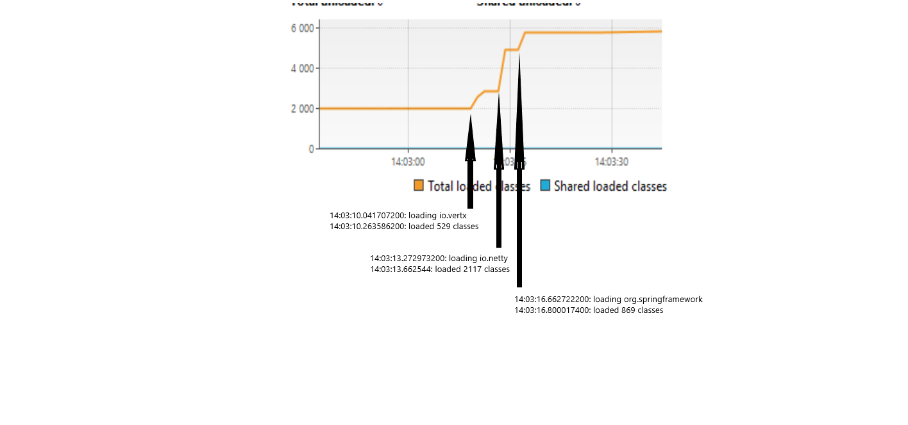
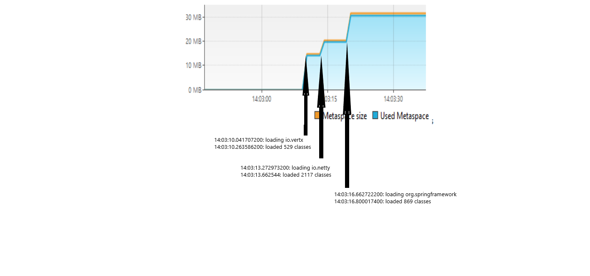
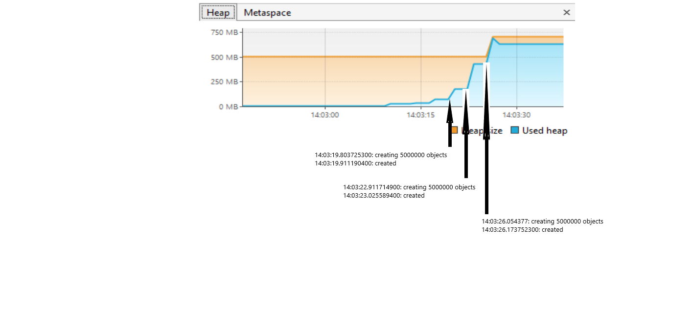

# Задача "Исследование JVM через VisualVM"

## ClassLoader

На скришоте отмечены моменты загрузки классов из пакетов io.vertx, io.netty, org.springframework.\
Моменты загрузки видны всплесками на скриншоте.

## Metaspace

На скришоте отмечены моменты загрузки классов из пакетов io.vertx, io.netty, org.springframework.\
Моменты загрузки видны всплесками используемой памяти на скриншоте.

## Heap

На скришоте отмечены моменты создания объектов в Heap.\
Моменты создания видны всплесками используемой памяти на скриншоте.
